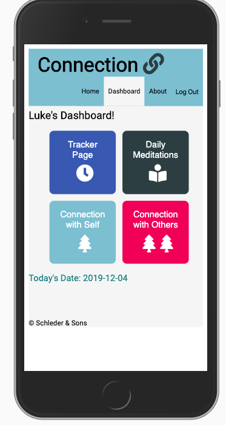
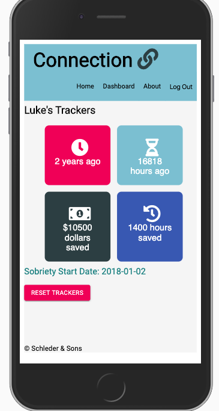
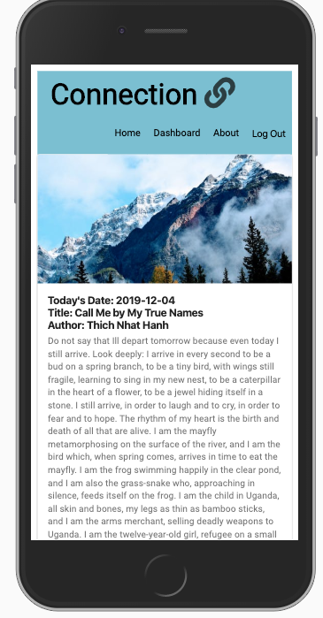
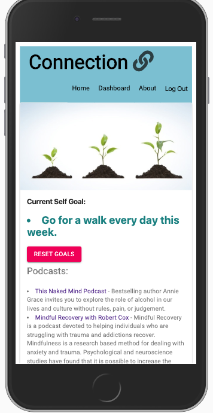

# Connection Recovery App
---

## Description

Duration: 2 Week Sprint

- For this solo project challenge I built a mobile first web application!  Connection was built to assist users that are struggling with addiction, substance abuse, or making change in their lives.  It allows users to track how long they have been making a change, how much money has been saved, and how much time they have saved.  There is a meditation/ reading page that randomly generates a reading from a local database.  They are also reminded of ways the user has already submitted to connect with themselves and others.  Resources for recovery from substance abuse are also listed, including podcasts, books, and online mental health resources.   

## Database Setup

1. Create a database named `connection`
2. Run the queries from `database.sql` on the `connection` database.
 
---
Website
---
Connection App (https://connection-recovery-app.herokuapp.com/#/home)
---
Screen shot

---

## Installation

1. fork this repository to your own github account
2. git clone onto local computer using terminal
3. open with code editor of your choice
4. npm install
5. npm start in terminal
6. npm run client in one terminal
7. npm run server in another terminal
8. go to http://localhost:3000/ to see Connection
---

## Usage

1. register user
2. login user
3. create connection goals in line with what you're trying to accomplish
4. view trackers and be inspired by progress
5. view and read meditations page
6. view self connection goal and resources
7. view others connection goal and resources
8. update goals or reset tracker date as neccessary 
9. logout
---
## Built With

- html
- css
- javascript
- node
- express
- body-parser
- pg
- axios
- react
- redux
- redux sagas
- redux logger
- react router dom
- react scripts
- material ui
- moment.js
- awesome fonts
- google fonts

---
## Acknowledgment 

- Thanks to Luke Schlangen and Prime Academy who equipped me to make this application a reality
---
## Support

If you have suggestions or issues, please email me at <Luke.Schleder@gmail.com>